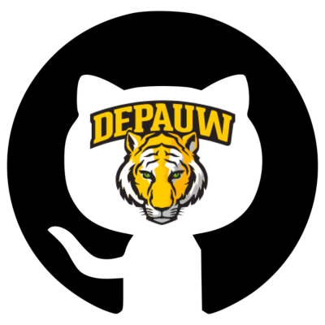
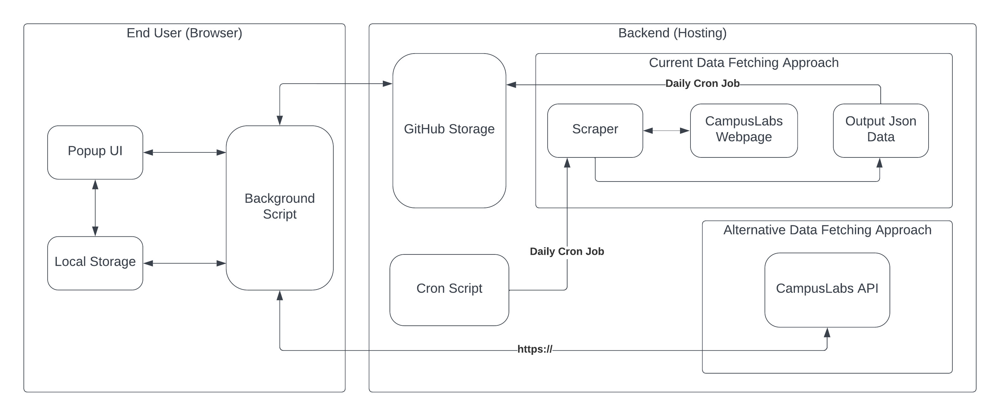

<h1 align="center">
  <a href="https://standardjs.com"></a>
  <br>
  <a href="<INSERT>">CampusLabs Chrome Extension</a> - Quick Search Upcoming Events at DePauw.
  <br>
  <br>
</h1>

<p align="center">
  <a href="https://github.com/joshhn/campuslabsChromeExtention/blob/main/LICENSE">
    
  </a>
  <!-- <a href="">
    
  </a>
  <a href="">
    
  </a> -->
  <a href="https://github.com/joshhn/campuslabsChromeExtention/graphs/contributors" alt="Contributors">
    
  </a>
</p>

<!-- <div align="center">

  [](<INSERT>)
</div> -->

## What is CampusLabs Chrome Extension?

CampusLabs Chrome Extension is a functional application that helps promote and enhance diversity and inclusion at DePauw University. We aim to improve campus climate for underrepresented groups and creating opportunities for diverse student recruitment,
retention, and success. This project is for TigerHacks Hackathon hosted by WiCS at DePauw University.

## Why CampusLabs Chrome Extension?

The CampusLabs Chrome Extension project displays DePauw campus events in an easy and accessible way and notify users daily. DePauw students won't worry to miss out interesting events and important opportunities.

## How does CampusLabs Chrome Extension work?

The CampusLabs Chrome Extension project takes data from the DePauw CampusLabs website and displays upcoming events in a centralized platform. Here are current supported features:

- Discover new opportunities and engage with different student groups and organizations by scrolling through the list of displayed events.
- Events that celebrate diversity and inclusion are highlighted.
- Users can enable daily notifications for the extension.
- Users can add events to Google Calendars.
- Each time a new event is updated, a small red icon next to the extension will appear.

## Architecture

This repository contains code for the CampusLabs Chrome Extension written in HTML, CSS, and JavaScript and the Python Scraper script to crawl upcoming events data from CampusLabs.




# How to set up CampusLabs Chrome Extension for local development?

<ol>
  <li>Fork this repo and clone to your local machine</li>
  <li>Go to <a href="chrome://extensions">chrome://extensions</a> </li>
  <li>Enable <a href="https://www.mstoic.com/enable-developer-mode-in-chrome/">Developer mode</a> by toggling the switch on top right corner</li>
  <li>Click 'Load unpacked'</li>
  <li>Select the entire 'campuslabsChromeExtention' folder</li>
  <li>Follow the below instruction to install Poetry and run scraper script</li>
</ol>

#### BONUS: Star ⭐ [this repository](https://github.com/joshhn/campuslabsChromeExtention) for further development of features. If you want a particular feature, simply [request](https://github.com/joshhn/campuslabsChromeExtention/labels/feature) for it!

### Environment variables

Before running the scraper script, one needs to install [Poetry - A Dependency Manager](https://python-poetry.org/).

### Install Poetry

See instructions [on the official website](https://python-poetry.org/docs/master/#installation) to install Poetry.
When possible, it is recommended to use the same version of poetry as the one used in CI workflows. The currently selected version is 1.4.2.

To check if Poetry is already installed:

```
poetry --version
```

### Install dependencies locally

One can review added dependencies in `pyproject.toml`. To install existing dependencies:

```
poetry install
```

### Add a new dependency

The general syntax is:
```
poetry add <dependency name>
```

To explicitly tell Poetry that a package is a development dependency, one runs `poetry add` with the `--dev` option. One can also use a shorthand `-D` option, which is the same as `--dev`:

```
poetry add <dependency name> -D
```

### Update a dependency

First, review the version constraint for that dependency in `pyproject.toml`. If the dependency you want to update does not appear here, it is a transitive dependency. But if it has an equality constraint, consider changing it first or poetry will stick to the currently selected version.

Then, run:
```
poetry update <package1> <package2> ... <packageN>
```
with all packages that need an update. Review its effect on `poetry.lock`. Make sure to commit the change.

To update all packages and their dependencies within their version constraints, run:
```
poetry update
```

Note: if there is a large change on `poetry.lock` when updating a single package, check that you are using poetry 1.1

### Run the Scraper script locally in the automatically created virtual environment

```
poetry run python3 data-scraper/scraper.py
```

## Development
There are several Python tools used to keep this code as clean and maintainable as possible. For the CI to pass on a PR, these checks should be run locally before pushing. The easiest way to run all of the checks is with pre-commit hooks.

### Set up pre-commit hooks

1. Install pre-commit:

To be able to run pre-commit hooks, [pre-commit](https://pre-commit.com/) must be installed. `pre-commit` is a developer
dependency in `pyproject.toml`. By running `poetry install` once, `pre-commit` should be installed and ready to be used
with `poetry run pre-commit --version`.

2. Install pre-commit hooks for the repository:

The pre-commit hooks for the repo are defined in `.pre-commit-config.yml`. The hooks define tools to be run on the code
for linting, formatting, etc. To set up these hooks, run:
```
poetry run pre-commit install
```

3. Running pre-commit hooks:

The pre-commit hooks can be run against all files with:
```
poetry run pre-commit run -a
```
The great thing about pre-commit hooks is that, once installed, they are automatically run when committing changes. If
a hook makes changes to any files it will fail the commit. The changes needed to be staged and committed again for the
hooks to pass and for the commit to be successful.

These same pre-commit hooks are run as part of the CI.

## Contributing

Pull requests are welcome. For major changes, please open an issue first
to discuss what you would like to change.

## License
[MIT](https://github.com/joshhn/campuslabsChromeExtention/blob/main/LICENSE)
